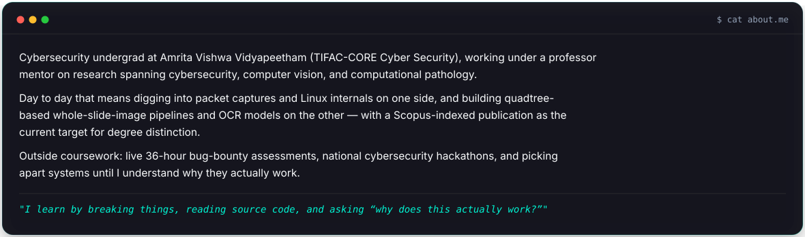
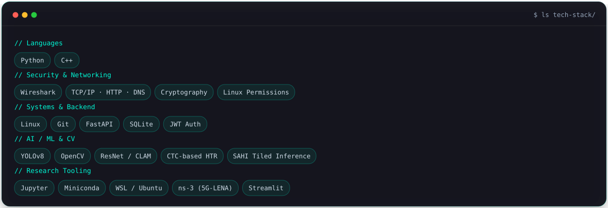
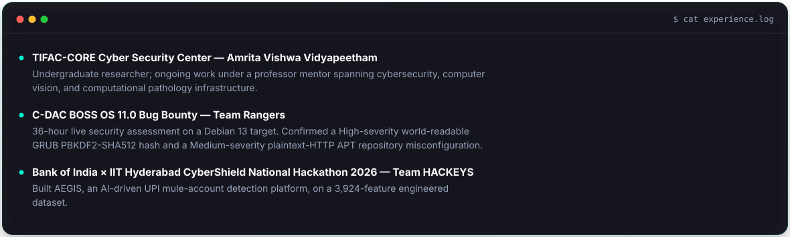
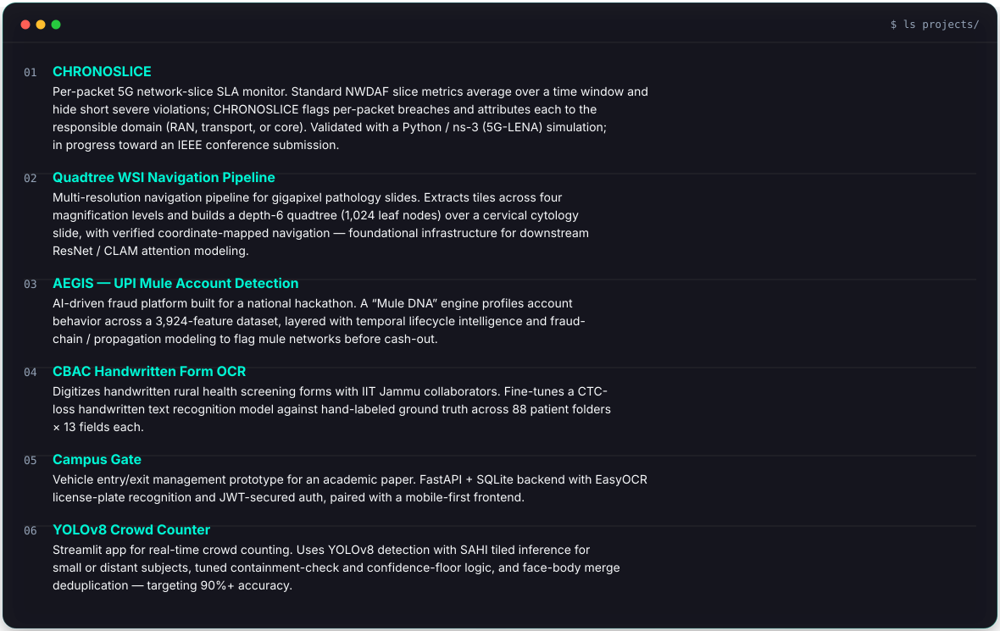
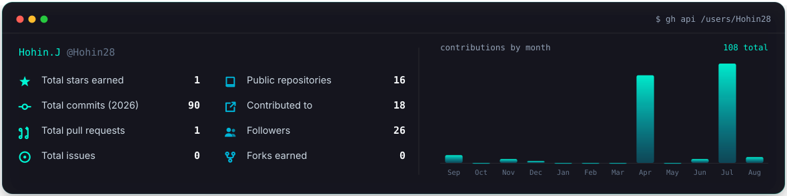
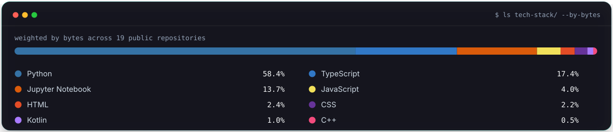
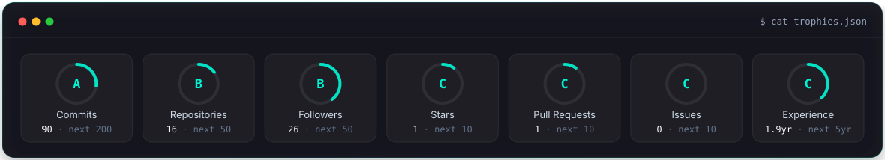
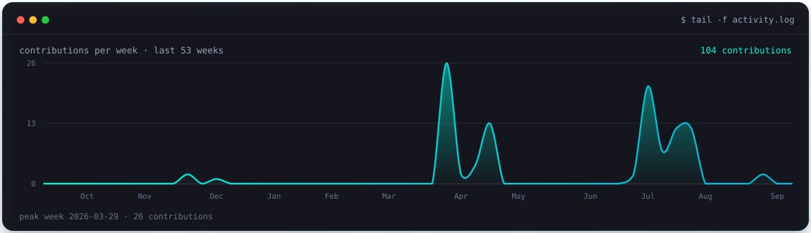
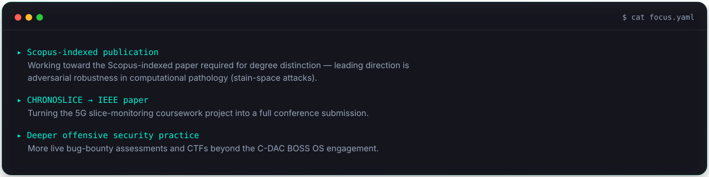

<picture>
  <source media="(prefers-color-scheme: dark)" srcset="./dark.svg">
  <source media="(prefers-color-scheme: light)" srcset="./light.svg">
  
</picture>

<!-- TODO: once you share your LeetCode / Codeforces handle, add the shields.io badge here, e.g.
 -->

  

  
  

  
  

  

  
  

<!-- TODO: add LinkedIn once you share the vanity URL, e.g.
 -->

<i>"I learn by breaking things, reading source code, and asking &ldquo;why does this actually work?&rdquo;"</i>

